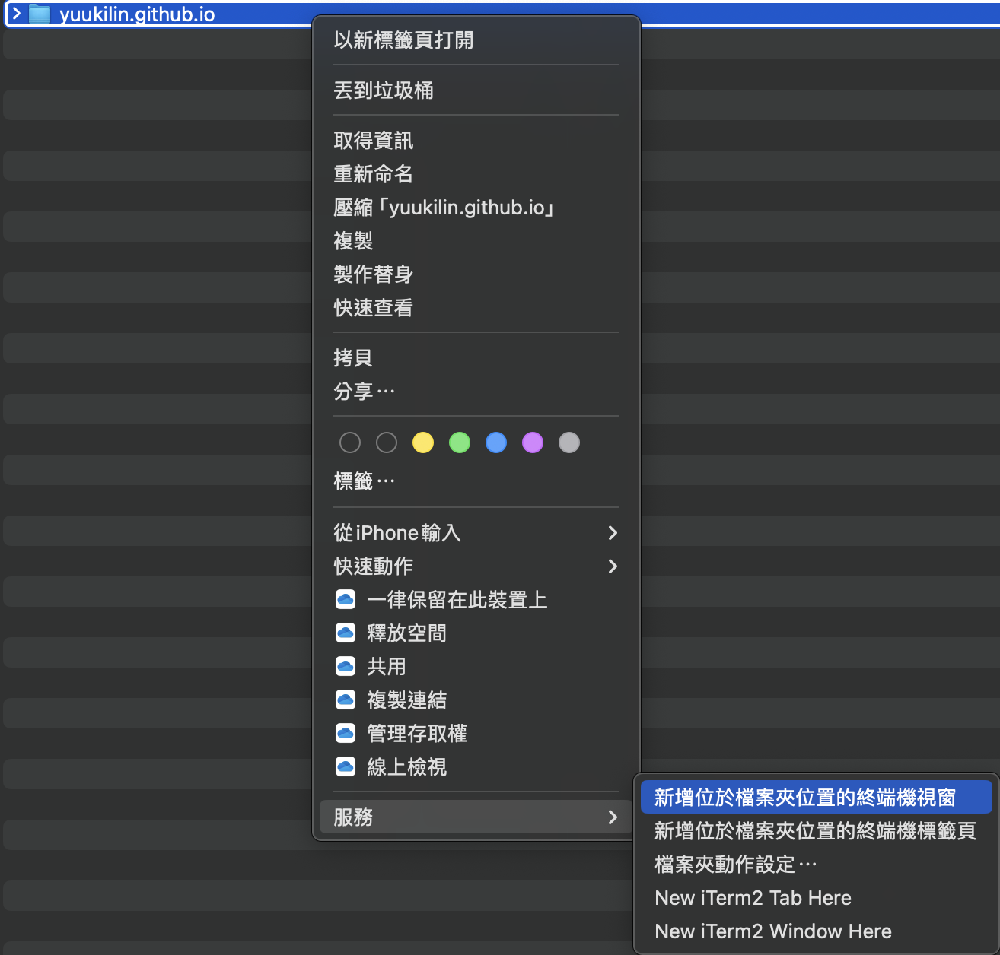
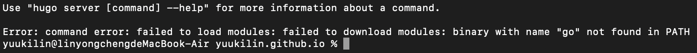
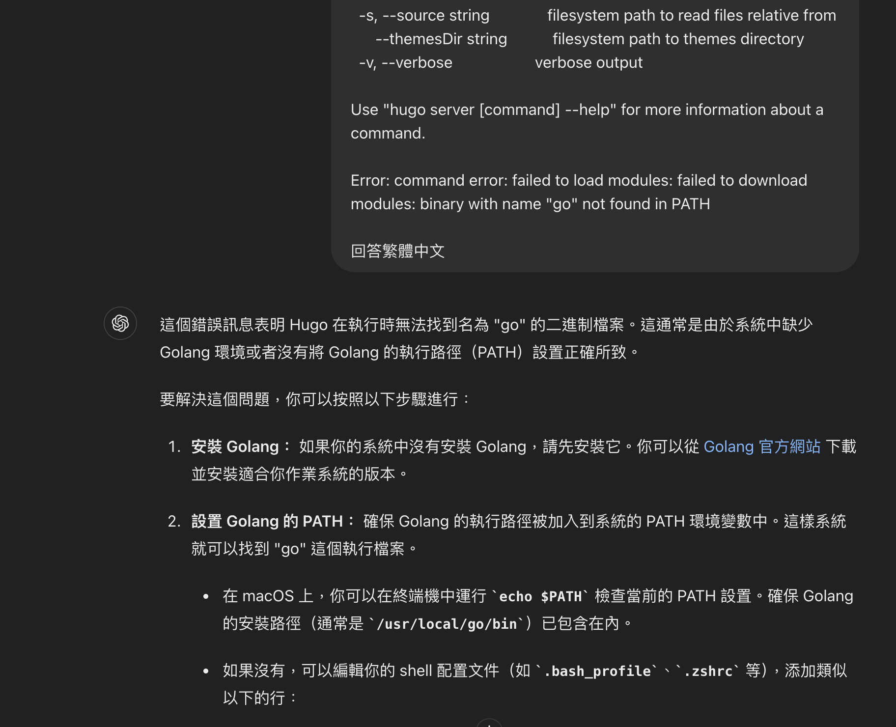
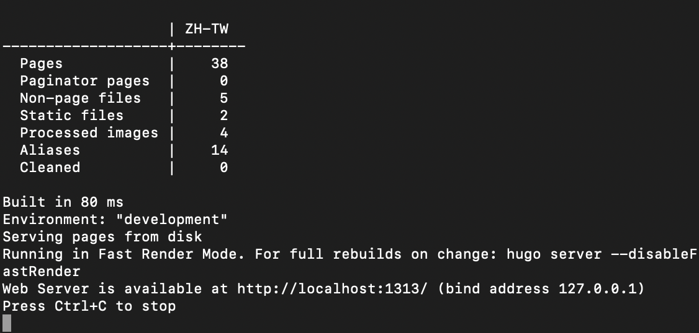

這系列文章會教妳怎麼0程式背景的情況下，用CHATGPT來幫助架設一個基於Hugo的個人網站，除了買個人域名（也可以不要買，只是買了很酷）外，基本上不用錢。    


這系列會誕生始於我買了1年半的 macbook air m2 主機板直接無預警陣亡，花了2萬修完之後，裡面的資料全部暴斃，所以要重新安裝Hugo，乾脆就把步驟一起寫下來了。
那就開始吧。

# 安裝Hugo
第一步，問CHATGPT。
![[Pasted image 20240713135122.png]]


用mac開啟終端機，輸入下面的程式碼，輸入你的密碼，安裝Homebrew
```
/bin/bash -c "$(curl -fsSL https://raw.githubusercontent.com/Homebrew/install/HEAD/install.sh)"
```
安裝好後再輸入
```
brew install hugo
```

接著去找自己喜歡的hugo主題模板，google就可以看到很多別人做的，  
我使用的是這個 [Stack](https://stack.jimmycai.com/) ，進到他的github頁面有教學怎麼Use this template，我是create一個新的取名為[yuukilin.github.io](https://github.com/yuukilin/yuukilin.github.io)  (自己的github名字.github.io)

-> Download GitHub Desktop

-> 在電腦建立一個repositories的位置

-> 對著資料夾按右鍵，開始終端機，測試看看


-> 輸入hugo server



結果跑出報錯訊息，我們就把這個訊息丟進GPT



ok，就是沒裝Golang，來裝一下

進官網下載，mac m1以上就是找arm版本的apk檔，intel的就是找x86的apk檔

裝完之後關閉終端機，再對我們repositories資料夾按右鍵，開始終端機，再輸入hugo server 



出現這樣就是成功了🎉🎉🎉

複製這段 http://localhost:1313/ 貼到瀏覽器上，就可以看到網站的樣子了

