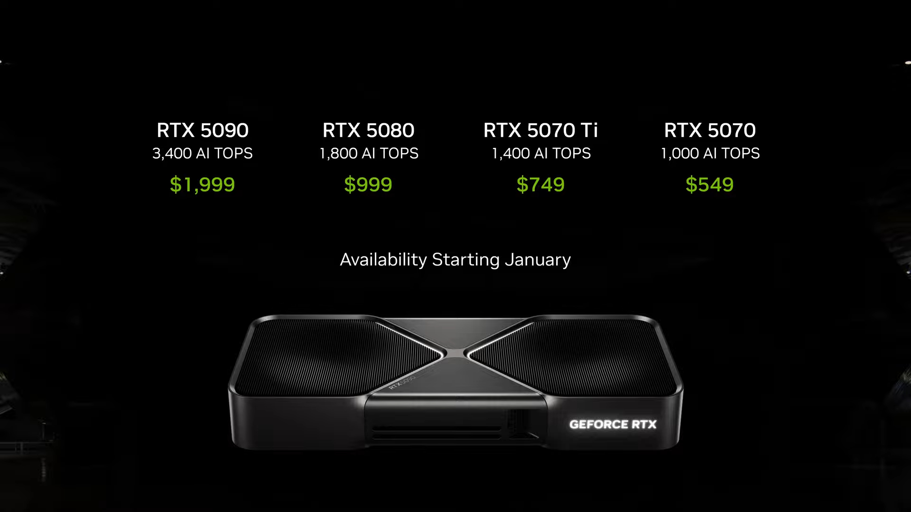
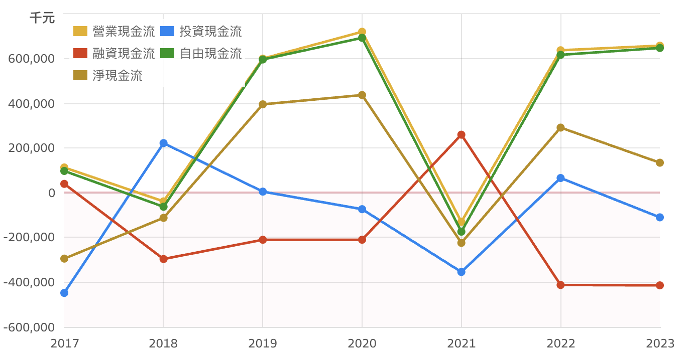

本篇研究主張海韻電(6203)為 2025 年新一代顯示卡換機潮中，最受惠的電源供應器廠商，預估股價 12 個月內可上看 102 元 ，潛在報酬率 41%。
# 研究摘要
## 投資重點簡介
海韻電是一家專注於高階電源供應器（PSU）的製造商，以電競領域作為主要目標市場，並以自有品牌「Seasonic」進行銷售。該品牌在自組市場的電競玩家間備受推崇。相較於其他電源供應器製造商涉入領域多元，海韻電高度集中於 PC 市場，因此業務表現與電競市場的景氣具有高度連動性。

2025 是 PC 遊戲大作的一年，現已發售的《天國降臨：救贖2》、《魔物獵人 荒野》已受到玩家熱烈討論，之後還有《艾爾登法環 黑夜君臨》、《邊緣禁地4》、《inZOI》、《劍星》等遊戲預計上市。除了新機需求外，部分遊戲對於硬體要求較高，也可望帶動顯卡及 PSU 更新潮。

新一代顯卡 Nvidia RTX50 系列於 2025 年 1 月發布、AMD Radeon RX 9070 系列於 2025 年 3 月 6 日發售，其建議電源供應瓦數都較目前玩家熱門使用的 RTX 30、RTX 10 系列大幅上升。對應部分新遊戲較高的硬體要求，玩家欲升級顯示卡，勢必要同步更換電源供應器。此外 RTX50 系列擴大支援 PSU ATX3.0 協議，亦會帶動電源供應器更換及單價提升。

海韻電為電源供應器類股中，最純的電競 PSU 公司，能最直接受惠於顯卡更新帶來的 PSU 更換潮，考量其股價淨值比位於歷史偏低檔，建議投資人買進。

## 投資建議
買進，預估 2025 年 EPS 10.69 元，本益比 12 倍，安全邊際取 8 折，目標價 102 元，相較 3/7 海韻電收盤價 72.5 元，尚有 41% 潛在上檔機會。

## 主要催化劑
新一代顯示卡 (NVIDIA RTX 50 系列、AMD 9070 XT系列) 推出及新 PC 遊戲大作對硬體高要求，帶動電源供應器替換及升級。

# 投資論點
## 1.  顯卡功耗要求提升及 ATX 3.0 規範，帶動 PSU 更換潮
### 海韻電營收增長，在過去由比特幣挖礦潮所帶動，與新一代顯卡發售幾乎沒關聯
2010 年至 2020 年間，顯示卡功耗需求增長有限，瓦數需求幾乎停留在 650W 內，玩家即便升級顯卡，也未必需要同步更換 PSU ，顯卡換代並未推升消費者對PSU 的需求。

尤其主流消費者傾向選擇價格更親民的銅牌或無認證 PSU。對於專注於高階、高功率市場的海韻電來說，僅在 2014 年及 2017 年受惠於比特幣挖礦潮，帶動短期營收增長。

直到 2020 年後，NVIDIA RTX 30 系列（2020Q4）與 RTX 40 系列（2022Q4）顯卡，對於電源供應器功耗要求才有明顯提升。同時，ATX 3.0 規範於 2022 年推出（支援 12VHPWR 接頭），促使消費者在提升顯卡時，也會同步升級電源。

此外，隨著高階顯示卡價格持續飆升，消費者更願意選用品質保證的 Seasonic 高階電源供應器，以避免顯卡可能的損壞燒毀，海韻電在此階段才開始受益於每次的顯卡換代。

### 新顯卡要求功率持續上升
2010 年至 2020 年，高階顯卡功耗增長緩慢，從 GTX 780 到 RTX 2080 官方建議瓦數皆在500W~700W 之間，功耗提升幅度有限，對 PSU 需求影響不大，消費者在提升顯卡時，不一定要換電源供應器。

2020 年後隨著 RTX 3090（建議 PSU 750W）、RTX 4090（建議 PSU 850W）及 RTX 5090（建議 PSU 1000W）的推出，功耗顯著攀升。消費者手上的舊有 PSU 無法滿足新顯卡功耗需求，促使在更新高階顯卡時，幾乎一定要同時更換電源供應器。

### 新一代高階顯卡擴大採用 ATX 3.0 規範，帶動 PSU 價量提升
	ATX協議：由Intel提出，旨在規範電腦主機板的尺寸、電源接口、I/O介面布局等，以提升相容性和組裝便利性。
	
ATX 2.0 規範於 2003 年提出，其後有多次針對電源效率和相容性優化的小型更新，但彼此差異不大，且可沿用。換句話說，過去 20 年間買的 PSU，假設功率足夠且沒有損壞，即便更新電腦設備也可以不用更換 PSU。

直到 2022 年2月，ATX 3.0 規範發布，為因應顯示卡持續上升的功率要求，以及峰值功耗問題（全力運算時會突然要求 2 倍以上的額定功率），而規定採用全新的 16-pin 接頭及要求更粗的線徑。同年 10 月起發售的 NVIDIA RTX 4080、RTX 4090 系列，也開始支援 ATX 3.0 規範。

對 PSU 廠商來說，採用 ATX 3.0 規範的 PSU ，其售價約較 ATX 2.4 規範的 PSU 上升約 15~20%。對消費者來說，為了避免昂貴的顯示卡燒毀，會更願意購買 ATX 3.0 規範 PSU。ATX 3.0 規範同時對 PSU 廠商帶來價跟量的提升。

2025 年新發售的 NVIDIA RTX 50 系列，更擴大支援 ATX 3.0 標準到中高階卡 RTX 5070 系列。

## 2.  2025 年高效能要求的遊戲大作帶動換機潮

2025 年遊戲市場有多款大作發布，已發售的《天國降臨：救贖2》、《魔物獵人 荒野》除了玩家眾多外，對於顯示卡配備的需求也有顯著上升，《魔物獵人 荒野》建議配置約等同於 RTX 3060 的顯卡。實際觀察遊戲社群回饋，因遊戲效能優化不佳，一般會建議需要使用更高等級的配置，以滿足在一定會畫質要求下順暢遊玩。參考官方建議遊玩品質“高”需要配置 RTX 4060 Ti，“極高” 需要配置 RTX 4070 Ti Super（VRAM 16GB）。另一大熱門《天國降臨：救贖2》更是在建議配置就要求 RTX 4070 以上的高效能要求。

與之對照，過去幾年的熱門遊戲，如《Cyberpunk 2077》、《黑神話：悟空》幾乎使用 RTX 10 、 20 系列仍可正常遊玩。
高效能新遊戲，搭配同時間發售的 RTX 50 系列及 AMD Radeon 9070 XT 系列，可望激起玩家為了追求遊玩體驗及畫質要求而升級相關設備。

今年稍晚預計還有《艾爾登法環  黑夜君臨》、《邊緣禁地4》、《inZOI》、《劍星》等遊戲上市，電競周邊大廠 Corsair Gaming 也在電話會議中透露，現象級遊戲《GTA 6》預計在 2026 年初登陸 PC 平台。後續可持續觀察遊戲上市熱度及對設備配置要求。

## 3. 品牌價值受電競自組玩家推崇
海韻電電源供應器，一直是玩家心中的品質保證。參考 PC 自組玩家聚集的 Ptt 電蝦版及遊戲社群平台巴哈姆特，可以觀察到海韻電 Seasonic PSU 是自組玩家的熱門選擇。

資料來源：Ptt

資料來源：巴哈姆特電玩資訊站

比較海韻電毛利率，與其他以 PC 市場為主要營收來源的同業，更可以觀察到海韻電因專注於高端產品線，及受到玩家青睞而得到的品牌溢價，為其帶來長期優於同業的高毛利率。

## 4. 同業中最純的電競類股，評價仍處於低檔

**海韻電(6203)** 約 99% 的營收來源於電源供應器業務，其中的約 90% 屬於 PC 市場，其餘約 10% 則來自通訊網路及工業等特殊用途領域。

海韻電商業模式包含以自有品牌銷售、ODM 及 OEM。其專注於高端 PC 市場的品牌策略，使其營收顯著受短期電競需求變化而波動劇烈，呈現出在新顯卡發布年大幅上漲，顯卡空窗期大幅回落的特性。在上一波產業庫存修正期間( 2024 年），營收及出現大幅下滑。
然而，此低迷期同時帶來極低的估值區間，也為投資者提供了潛在的買入機會。

資料來源：財報狗

比較其他同樣受到網友推薦的 PSU 品牌，**台達電(2308)** 事業體龐大，電源及零組件事業營收僅佔整體營收48%，且其電源項目包山包海，涵蓋各類工業、醫療、伺服器等，單一顯卡更新潮對其影響有限。

**僑威(3078)**
營收佔比約 85% 來自 PC PSU，商業模式以代工為主，推測因其終端客群較分散，產品包含極低階到極高階、涵蓋商用到個人，故其營運波動不像海韻電主要專注於電競利基市場這般激烈，在 2024 產業衰退期，未出現極低的估值。目前評價也已處於歷史高點，持有風險較高。

資料來源：財報狗

**全漢(3015)**
電競相關營收約 19%，產品應用面廣泛，受惠單一新顯卡事件程度低。

資料來源：財報狗

其餘如 **群電(6412)** 電腦電源產品佔營收僅約 40% ，**安鈦克(6276)** PSU 營收佔比僅約53%，且其高階電源供應器產品由海韻電代工。

比較 **海韻電(6203)** 其他同業，皆有評價已高，或者產品應用面廣泛，受惠單一新顯卡事件程度較低的問題。

# 公司概況

## 股權結構

資料來源：公司年報

公司股權由家族持股 50.13% ，包含創辦人張正宗、其妻魏金花、子女張修誠等人及名下投資公司擎海。公司股權穩定，經營層利益與投資人一致。

## 公司產品

資料來源：法說會簡報

海韻 PSU 主要分為五種等級，G12 及 Core 較低階，主要用於套裝機市場。FOCUS 是 CP 值最高的主力產品線，多用於如 RTX 4050、4060 等最多玩家使用的中階顯卡市場。Vertex 及 Prime 則是給頂級顯卡及玩家使用，擁有最長的 12 年保固，講求最高級的靜音、溫控、能源效率、裝置保護。

	G12：入門至中階，半模組或固定電纜，5-7 年保固，價格約 80-120 美元。
	Core：中階，全模組/半模組/固定選擇，7 年保固，價格約 80-120 美元。
	Focus：中高階，半模組或全模組，5-7 年保固，價格約 100-200 美元。
	Vertex：高階，全模組，12 年保固，價格約 150-300 美元。
	Prime：頂級，全模組，12 年保固，價格約 200-500+ 美元。

海韻電在 2005 年即通過 80 PLUS 認證，是全球第一個通過 80 PLUS 認證的製造商。據公司在法說會表示，當初並不是為了認證而去特別去研發，只是在該項認證問世的時候，隨手將公司產品拿去申請，沒想到就直接通過了。

以此事件可以看出，海韻電對自家產品品質的高度要求。目前海韻的主要產品也皆有 80 PLUS Gold 以上認證。

	80 PLUS 是一項電源供應器效率認證，用於保證 PSU 有大於 80% 的電能轉換效率，越高等級如Gold/Platinum/Titanium 代表有更高的轉換效率，高效率代表能夠大幅節能和產生更少廢熱。

## 營收比重

海韻電以電源供應器之生產與銷售為主要營業內容，除了以自有品牌 Seasonic 銷售之外，也替國內外知名廠牌代工 PSU ，如ASUS、Antec、NZXT 等代工，惟其自有品牌及代工的營收佔比，公司並未對外公布。

## 2025 年近 3 月累計營收年增率可望重回成長，帶動股價攀升

資料來源：財報狗

參考歷史，海韻電股價與近 3 月累計營收年增率高度相關。
2024 年 PSU 產業處於庫存去化期間，尤其因顯卡世代空窗期，致使海韻電營收基期較低。
展望 2025 年在新顯卡帶動下，可望使近3月累計營收年增率重回成長，並帶動股價攀升。

資料來源：財報狗

## 帳上現金充沛，能安全度過景氣循環

## 中國產能關稅風險已避
海韻電產能包含中國及台灣，低階產品會外包給其他廠商生產，留下高階產品自行生產，以提升毛利率。

根據公司在 2021 年 9 月 發布的公開聲明書，提到：
	
	公司在 107 年下半年即已在台灣及東南亞國家尋求分散生產基地，以避免美中貿易戰對大陸出口加徵 25%額外關稅之風險。目前銷美產品均已順利達成分散產能、降低風險之政策。
	
	開發策略合作夥伴，以機動性增加產能，並把技術性低的作業與外包廠合作，以把主要產能保留給高階產品、OEM/ODM 產品的生產。

海韻電已在前次中美貿易戰後，加大台灣地區產能，並透過外包廠商分散低階商品產能，以此降低中國關稅風險，未來應不至於受到美國對中國新增加的關稅影響。

資料來源：公司年報

# 產業分析

## 全球 PC 玩家人數持續增長， Steam 突破 4,000萬同上，產業趨勢向上
在 PC 遊戲市場中，3A 大作因為具備超高畫質及強大的運算引擎，對於玩家配備的要求非常高，也是帶動玩家會想要升級設備的一大主因。

玩 3A 大作最多人使用的遊戲平台為 Steam ，該平台同時上線的活躍玩家人數，近期在《魔物獵人 荒野》的帶動下，已經正式突破 4,000 萬人。

	Steam 是一線上遊戲平台，提供超過 50,000 款遊戲購買與下載，涵蓋大廠及獨立作品。在 PC 遊戲領域佔據龍頭地位，總註冊用戶數超過 10 億人，全天同時上線玩家約接近 4000 萬人次。
	
PC 遊戲玩家人數快速成長，一部分受益於社群媒體傳播，一部分也得益於疫情，讓許多人轉變成長期遊戲玩家，讓玩電動的客群不再只是所謂的宅男。
統計 Steam 同時上線的活躍玩家人數 2015 ~ 2019 CAGR 約 7.29%，疫情後的 2019 ~ 2024 CAGR 則躍升為 15.52%。

資料來源：SteamDB

## 遊戲玩家就是會想升級，即便新一代顯卡評價不好
NVIDIA 前一代顯卡 RTX 40 系列，在上市之初，普遍被玩家認為售價過高，效能升級過少，甚至被譏為“只有盤子會去買”。 且其上一代 RTX 30 系列，因效能顯著升級及定價得宜，成為史上銷量最好的一代。其中的 RTX 3060 更成為玩家最主流的選擇。RTX 40 系列在此背景下，從來都不被玩家所看好。

然而根據 Steam 最新於 2025/2月之統計，仍可看到 RTX 40 系列最終還是成為了玩家主流採用的選擇。由此可知，在電競 PC 產業中，單是新顯卡發售，無論其評價，都會是一個強力的正面驅動因子。

另外也可以發現，玩家主流會使用 CP 值最高的 60、70 階中高階顯NVIDIA 顯卡命名規則卡，並且仍有一定比例的玩家尚在使用 NVIDIA 10、20 代顯卡，是非常有機會在本次升級的族群。 

	NVIDIA 顯卡命名規則：RTX 表示支援光線追蹤技術。四位數字，前兩位數為世代，後兩位數為性能高低，例如在50世代，5090比5080性能更好。後綴（如 Ti、Super）表示加強版，效能上Ti>Super>無後綴。

資料來源：Steam

## NVIDIA 新一代 RTX 50 系列罵聲不斷，供給問題尚待緩解
### NVIDIA RTX 50 系列，發佈萬眾矚目

資料來源：NVIDIA

NVIDIA 50 系列顯卡，在發布之初，因其大幅提升的效能表現及實惠的定價，受到玩家熱烈追捧，紛紛迫不及待要用手上的現金升級一波。

其中最廣為玩家流傳的就是 NVIDIA CEO 黃仁勳所說的 “5070 = 4090"，意即 RTX 5070 的效能，足以匹敵前一代最頂級的顯卡 RTX 4090，以此顯現 50 系列在效能上的大幅提升。
尤其 RTX 5070 定價 $549 美元，甚至還低於前一代 RTX 4070 的 $599 美元。
50 系列無論在效能或價格上都極具競爭力，因此在發售前受到玩家高度期待。

### NVIDIA Nvidia RTX 50 系列，實際上市，誇耀的效能被發現沒穿褲子
然而，NVIDIA RTX 50 系列在實際發售後，經過多方媒體評測，發現除了 RTX 5090 外，其他等級的顯卡實際效能，皆未如一開始宣稱的大幅提升，而僅是小幅升級。

其中，被批評的最嚴重的，莫過於當初誇耀的 RTX 5070。實際經評測，RTX 5070 效能僅小幅勝於 RTX 4070 Super ，並介於及 RTX 4070 Ti 之間，根本連 RTX 4080 都沒碰到，更別提 RTX 4090。

資料來源：TechPowerUp

國外知名評測媒體也紛紛撻罰 RTX 5070 這張卡。

資料來源：ptt

### 嚴重缺貨大幅漲價，讓 RTX 50 系列成為一場災難
玩家不滿 RTX 50 系列效能僅微幅提升，或可以歸咎於當初發布時將大眾的預期拉得太高。
但實際上市之後嚴重的缺貨問題，造成零售價大幅溢價，更是將本次 RTX 50 系列化為一場災難。

從 RTX 5090 發售第一天開始起，每一等級的 50 系列顯卡皆有嚴重缺貨的問題。零售商除了規定買顯卡需限組整機外，也將單卡售價大幅拉高，甚至連品牌廠也悄悄地上調定價，讓 50 系列顯卡與當初官方參考價格相距甚遠。

以 RTX 5080 為例，官方定價以匯率 35 換算約台幣 $35,000 元，但在知名購物網站 PChome上，只能看到要價 10 萬元以上的組合包，還都已銷售一空，一般玩家根本無法購得，更別提用當初所說的官方建議價格購買。 

資料來源：PCHOME

觀察全台最大電腦零組件零售商「原價屋」官網，也可看到在 5090/5080/5070 Ti系列，皆需要組整台電腦，不可單買，且其售價經網友發現，已偷偷進行多次上調。

資料來源：原價屋

### RTX 50 系列供給，可能在未來幾個月大幅上升，使售價回歸正常
RTX 50 系列供給短缺，據稱是因晶片設計 debug 作業、台灣地震造成台積電晶圓報廢及部分廠商囤貨等等原因導致。

RTX 50 系列嚴重的漲價缺貨，有可能會影響玩家興趣，致使升級換機潮未發生。

所幸目前已有消息指出，晶片設計問題已解，且 NVIDIA 已提高投片量，RTX 50 系列供給有望在 3 月起逐步緩解，同時，總是不受期待的顯卡老二 AMD，也帶來更好的消息。

	新浪財經：RTX 50系列显卡供应有望大增，高端型号或迎来降价潮

## AMD RX 9070 XT 或可救場
### RX 9070 XT 效能小輸  RTX 5070 Ti ，但價格便宜 20%
AMD 新一代顯卡 RX 9070 XT 在眾人不屑一顧之時發布。
極其實惠的價格在 RTX 50 系列售價高漲之際，馬上吸引眾人目光。

AMD 新一代顯卡 RX 9070 XT 對標 NVIDIA RTX 5070 Ti ，建議售價$599美金，相較 5070 Ti 便宜將近 20% ，在其官方宣傳效能上，更與 RTX 5070 Ti 相當。

資料來源：AMD 

實際於 3/5 效能解禁後，經眾多媒體評測，RX 9070 XT 整體效能確實僅略輸 RTX 5070 Ti ，部分領域甚至會超越 RTX 5070 Ti，整體當然也遠勝 RTX 5070。

換句話說 AMD RX 9070 XT 是一張有著  RTX 5070 Ti 效能，但只用  RTX 5070 價格來賣的高 CP 值顯卡。

資料來源：TECHPOWERUP 

資料來源：Youtube 

### 更重要的是： RX 9070 XT 供給量非常充足
根據澳洲知名電腦硬體評測頻道 Hardware Unboxed 表示，9070XT 備貨甚至比整個 RTX 50系列加起來還多。

台灣原價屋在其開賣前公告，雖然表示 RX 9070 XT 供貨同樣吃緊 (部分網友認為他們在囤貨)，然而其販售的 9070XT 首批貨量也較 RTX 5080 多出約 2 倍。預定販售的技嘉 GAMING OC 版售價 $22990元，相當於官方建議售價，並無溢價，顯見整體貨量應該是非常充足。

資料來源：X 

### AMD 顯卡成為玩家替代選擇，應可分流需求，使 NVIDIA 售價回歸正常
觀察一篇在知名遊戲論壇《巴哈姆特》的投票中，可以看到這次 AMD RX 9070 XT 系列，在 RTX 50 系列的災難後，成為玩家心中的希望。

資料來源：巴哈姆特 

AMD 顯卡在過去長期因為效能及穩定度皆輸 NVIDIA ，從來都不是大部分玩家的選項。
根據 Steam 統計，AMD 顯示卡在遊戲玩家中，只有 11.49 % 的使用率。
然而這次的 AMD RX 9070 XT 系列，有望在 NVIDIA 50 系列災難後，一舉拉升市占率，並帶動設備升級潮的發生。

AMD RX 9070 XT 系列也有望分流玩家需求，讓部分原定購買 NVIDIA 顯卡的玩家轉向，從而使部分囤貨廠商在面臨壓力下，釋出手中的 NVIDIA 顯卡存貨，進而使 NVIDIA 顯卡售價回歸正常水準，以利等待中的消費者出手換機。

 
資料來源：steam 

### 無論最終誰勝出，電源供應器仍會是升級潮發生時的最大受益者
RX 9070 XT 官方版熱設計功耗(TDP)為 304W ，建議電源供應器瓦數為 750W ，然而因其實際並無發售官方版，參考各間品牌廠，建議瓦數均較官方建議高上許多，例如撼訊紅魔版本，建議 PSU 瓦數為 900W 。

經各方媒體評測，RX 9070 XT 功耗較 NVIDIA RTX 系列高上許多，建議需配備 850W ~ 1000W 之電源供應器。相較之下，NVIDIA RTX 4070 Ti 建議 PSU 為 700W ，包含其他更舊、更低階顯卡，如要升級為 RX 9070 XT ，玩家一定要同時更換電源供應器。

資料來源：巴哈姆特 

後續應在 3/6 AMD RX 9070 XT 系列實際發售後，持續觀察玩家接受度及是否有災情發生。
然而，在顯卡換代及新遊戲大作連發的趨勢下，無論 NVIDIA 或是 AMD 哪家顯卡最終在玩家心中勝出，背後需要更換的電源供應器，仍會是升級潮發生時的最大受益者。

# 財務預測與估值

## 財務預測
1. **營收：** 2024 年 **電源供應器單價**，預期在產業需求疲弱的狀況下特價求售，致使單價年增率下降 5%。2025 年受惠於新一代顯卡功耗提升及 ATX 3.0 規範擴大採用，預計會帶動高階、高功率產品銷售，估計單價將較前一年提升 10%。

   2025 年 **PSU 銷量** 預估 1,254 千顆，係考量顯卡 RTX 50 系列評價與 RTX 40系列同樣不佳，惟 RTX 40 前一代 RTX 30 系列為史上銷量最佳之顯卡，隔代升級的玩家應會明顯較少，預估RTX 50 系列為 PSU 帶來的銷量會介於 RTX 40 系及 RTX 30系之間，偏向 RTX 40系，故使用 2021 年之銷量 2,037 x 0.2 + 2023 年之銷量 1,058 x 0.8，預估 2025年銷量為 1,254千顆。 

2. **毛利率：** 預期高階、高功率產品佔比提升，2025 年各季毛利率預估較 RTX40 系列發售後之 4 季（2022Q4-2023Q3）各提升 1.5%。
   
3. **營業費用：** 海韻電之營業費用絕對數字長年維持在同一區間，本次預估 2025 年營業費用較 2024 年上升約 3%，較 2023 年上升約 8%。

單位：百萬元

## 估值計算
預估 2025 年 EPS 10.69，參考 RTX 30 系列發售的 2021 年及 RTX 40 系列發售的 2023 年本益比區間分別在 (15.5x-8.2x)、(18.29x-8.46x)，2025 年以本益比 12 ，安全邊際 8 折計算，給定目標價 102 元，相較 3/7 海韻電收盤價 72.5 元，尚有 41% 潛在上檔機會。

# 風險與因應措施

## 潛在風險
1. 後續遊戲大作表現差勁，未帶起升級換機潮發生
2. 顯卡供給問題長期維持，量少價高致使升級換機潮未發生
3. 海韻電受同業競爭市占率下降
4. Seasonic 出現嚴重品管問題

## 風險因應措施：原價屋網路組機數統計
主要風險應為升級換機潮並未實際發生。
此處參考台灣最大電腦零組件廠商 「原價屋」所公布的網路組機數量，來推論全球 PC 換機潮的狀況。觀察歷史，原價屋之組機數量，與海韻電之三個月平均月營收具有一定相關性。

目前網路組機數量並未明顯增加，係因新一代顯卡，原價屋皆限制需要到實體門市購買，不接受網路下單。

預期 3、4月後顯卡供給量會明顯上升，待原價屋不再限制現場組機後，即可透過網路組機數量圖，來觀察實際換機潮發生情形，以此判斷海韻電潛在受惠程度。

資料來源：原價屋、自行爬蟲整理 

# 結論

海韻電（6203）2025年受惠於：
1. 遊戲大作連發，帶動玩家升級需求
2. 新一代顯卡要求功耗上升、 ATX 3.0 規範擴大採用
3. 估值仍低，受惠電競多頭趨勢最多

總結以上，本篇研究認為海韻電(6203)會是本次潛在發生的電競 PC 設備升級潮中，最大的受惠者。

預估目前股價在新一代顯卡已經發售後，漲勢仍不明確，係因投資人考量顯卡缺貨漲價亂象，會影響換機潮發生。惟本篇研究認為，缺貨問題應會在未來幾個月內，隨著 NVIDIA 供給上升及 AMD 顯卡分流而緩解，致使換機潮發生，並帶動海韻電營收成長，故建議投資人買進。

後續應持續觀察：
1. 顯示卡供給是否確實在 3、4 月後逐步開出，以利顯卡零售價回歸正常
2. 新遊戲發售後評價，是否有引起更多玩家參與
3. 海韻電營收近三個月營收年增率是否持續向上
4. 原價屋網路組機數，在取消限到店購買後，是否有明顯上升

------------------------------------------------------------------------
# 附錄與參考資料

## 相關財務數據表格

資料來源：財報狗 

## 資料來源

1. [ATX12V电源标准解读v1.0](https://www.fcpowerup.com/psudg/)
2. [【關鍵報告】ATX 是什麼？看懂最新電源供應器 ATX 3.0 規格與投資機會](https://blog.fugle.tw/atx-power-supply/)
3. [看來蘇媽要贏麻了 5070=4070 Super++](https://www.ptt.cc/bbs/PC_Shopping/M.1741097855.A.A34.html)
4. [定錨產業筆記](https://investanchors.com/user/vip_contents/17397614751319)
5. [新浪財經：RTX 50系列显卡供应有望大增，高端型号或迎来降价潮](https://finance.sina.com.cn/stock/relnews/us/2025-02-17/doc-inekufee4030999.shtml)